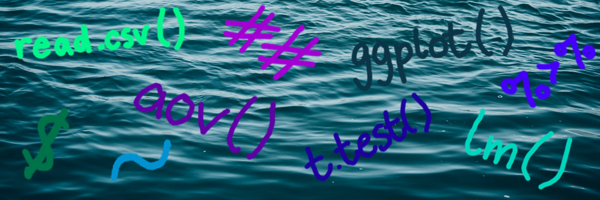
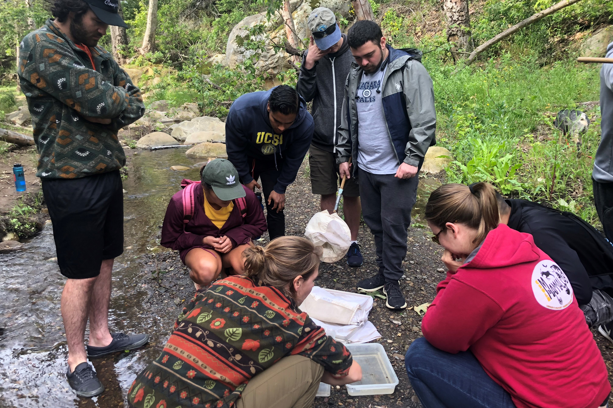
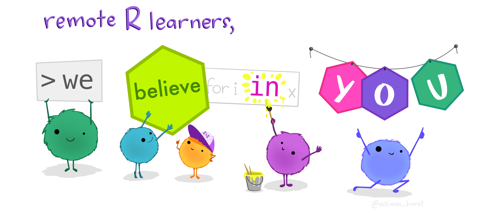

```{r setup, include=FALSE}

# Load packages:
library(learnr)
library(tidyverse) 
library(kableExtra)
library(lubridate)
library(plotly)
library(agricolae)
library(calecopal)
library(cowplot)


# Data for feedback analysis
feedback <- read_csv('student_feedback_fall2020.csv')

# Data for Intro to R:
water <- read_csv('goleta_rainfall_discharge.csv') %>% 
  mutate(type = factor(type, levels = c('Rainfall', 'Discharge'))) %>% 
  mutate(date = dmy(date))
water2 <- water %>% 
  pivot_wider(names_from = type, values_from = value) %>% 
  select(date, Rainfall, Discharge) %>% 
  rename(Date = date)
labs <- c("Daily Rainfall (in)", "Average Discharge (cubic ft/s)")
names(labs) <- c("Rainfall", "Discharge")

# Data for Case Study:
chem_param <- read_csv('chemical_parameters.csv')
chemical_parameters <- chem_param %>% 
  arrange(site) %>% 
  select(-location, -treatment, -replicate)

# Tutorial options:
tutorial_options(exercise.timelimit = 10)
theme_set(theme_classic())

```

<style type="text/css">
.table {

    width: 500px;

}
</style>

## There's an app for that!

### Interactive teaching tools for the biology classroom

---

***Kate Culhane,*** *Department of Ecology, Evolution, and Marine Biology, UCSB*

*kathrynculhane@ucsb.edu*

```{r r_sea, echo=FALSE, out.height="100%", out.width="100%"}

```

***How do we teach students real-life statistical interpretation without getting bogged down by programming jargon?***

---

### **The Problem**

```{r stormyr, echo=FALSE, out.width="100px", out.extra='style="float:left; padding:20px"'}

```

Undergraduate ecology courses often try to incorporate as much of the authentic scientific process as possible, from data collection in the field to analysis and interpretation of results. Unfortunately, **the statistical experience of students coming into these courses can vary wildly.** While attempting to meet the needs of all students, many courses resort to using outdated statistical softwares. Although these do not require coding by students, they are often finicky to use and not longer relevant in the workforce.

```{r echo=FALSE, warning=FALSE}

experience <- feedback %>% 
  select(previous_experience) %>% 
  separate(previous_experience, c('exp1', 'exp2', 'exp3', 'exp4'), sep = ', ') %>% 
  pivot_longer(1:4, values_to = 'experience', values_drop_na = TRUE) %>% 
  mutate(experience=factor(experience, levels = c('No statistics experience',
                                                  'High school statistics course',
                                                  'Tentative R user',
                                                  'Have R and R Studio installed',
                                                  'Confident R user',
                                                  'Biometry (EEMB 146)'))) %>% 
  group_by(experience) %>% 
  tally() %>% 
  mutate(percent = paste0(round(n/90*100, 0), '%'))

kable(experience[-2],
      col.names = c('Prior statistical experience', 'Students'),
      caption = '***Results from an end-of-course student survey (90 responses).*** *Students reported a wide range of prior statistical knowledge.*') %>% 
  kable_styling(bootstrap_options = c('striped', 'condensed'),
                full_width = FALSE,
                position = 'center') %>% 
  column_spec(1, width = '7cm')
  
```

The statistical programming language **R** is broadly used in ecology and other data science fields, and therefore is an important skill for students to learn. Unfortunately, R is not friendly for beginners, and the challenge of learning a coding language and statistical skills on top of field-specific course material can prove overwhelming. Since the learning objectives of most ecology courses are primarily focused on **interpreting statistical results in a biological context**, there is a need for a streamlined and user-friendly statistical tool for the classroom that still allows the growth of more advanced students.

```{r field_trip, echo=FALSE, fig.show="hold", out.width="50%", fig.align="default"}

knitr::include_graphics('images/field_2.jpg')
```
*Students collecting data during field trips to San Roque Creek and Rattlesnake Canyon near Santa Barbara, CA.*

---

### **The Solution**

```{r rainbowr, echo=FALSE, out.width="100px", out.extra='style="float:left; padding:20px"'}
knitr::include_graphics('images/rainbowr.gif')
```

**R labs:**

Interactive tutorial-style web applications that allow students to analyze and interpret data within an intuitive user interface, paired with companion code for more advanced students. Tutorial web apps (like this one!) can be created using the `learnR` package. This allows for the focus to remain on **biological interpretation of data,** while still allowing for motivated students to practice coding.

<br>

#### Advantages:

$\Longrightarrow$  **Accessible via any web browser**

- No software, liscences, or downloads necessary

$\Longrightarrow$  **Adjustable by skill level**

- *The R novice:* interacts with R entirely through tutorial web app
- *The semi-confident R user:* modifies the provided code in the tutorial interface, [RStudio Cloud](https://rstudio.cloud), or RStudio
- *The R expert:* writes their own code in RStudio Cloud or RStudio with the provided datasets

$\Longrightarrow$  **Tailored to fit course material**

- Can include background information alongside statistical analyses in order to emphasize important course material

---

### **Do they work?**

We tested the feasability of R labs during a remotely-taught quarter at UCSB. We used a series of R labs for teaching the section component of Stream Ecoclogy (EEMB 148) in spring quarter 2020. After the course, we distributed an end-of-course survey to judge effectiveness of the R labs and pinpoint areas of improvement. 90 students (out of 130) completed the survey; selected quotes and summary figures are below.

<br>

#### Positive feedback

- *"I enjoyed the R tutorials a lot. I thought they were very well made. I liked how clear and focused they were. It made the statistics as bite sized as possible where i could focus on the ecology which was really cool."*
- *"It was fun to learn about real world efforts and real world ideas. The R tutorials honestly made the class a lot more understandable."*

<br>

#### Ease of use and difficulty of material

Survey questions:

*- Please rate the ease of navigation of the tutorial.*
*- Please rate the difficulty of the tutorial content.*

```{r echo=FALSE, fig.align="center", fig.width=7, fig.height=3}

# Navigation
fig_nav <- feedback %>% 
  mutate(tut_navigation=factor(tut_navigation)) %>% 
  group_by(tut_navigation) %>% 
  tally() %>% 
  mutate(percent = round(n/sum(n)*100)) %>% 
  ggplot(aes(x = 1, y = percent, fill = tut_navigation)) +
    geom_bar(width = 1.3, stat = 'identity') +
    scale_fill_manual(values = rev(cal_palette("kelp1"))) +
    geom_label(aes(x = 2, label = paste0(percent, '%')),
               position = position_stack(vjust = 0.5),
               alpha = 0.4, color = NA) +
    geom_text(aes(x = 2, label = paste0(percent, '%')),
              position = position_stack(vjust = 0.5), fontface = 'bold') +
    ggtitle('Tutorial navigation') +
    theme_void() +
    theme(legend.position = 'none',
          plot.title = element_text(hjust = 0.5)) +
    coord_polar('y', start = 0, direction = -1)

# Difficulty
fig_mat <- feedback %>% 
  mutate(tut_difficulty=factor(tut_difficulty, levels=unique(tut_navigation))) %>% 
  group_by(tut_difficulty) %>% 
  tally() %>% 
  mutate(percent = round(n/sum(n)*100)) %>% 
  ggplot(aes(x = 1, y = percent, fill = tut_difficulty)) +
    geom_bar(width = 1.3, stat = 'identity') +
    scale_fill_manual(drop = FALSE,
                      values = rev(cal_palette("kelp1"))) +
    geom_label(aes(x = 2, label = paste0(percent, '%')),
               position = position_stack(vjust = 0.5),
               alpha = 0.4, color = NA) +
    geom_text(aes(x = 2, label = paste0(percent, '%')),
               position = position_stack(vjust = 0.5), fontface = 'bold') +
    ggtitle('Tutorial content') +
    theme_void() +
    theme(legend.position = 'none',
          plot.title = element_text(hjust = 0.5)) +
    coord_polar('y', start = 0, direction = -1)

# Legend
fig_legend <- feedback %>% 
  mutate(tut_navigation=factor(tut_navigation)) %>% 
  group_by(tut_navigation) %>% 
  tally() %>% 
  ggplot(aes(x = '', y = n, fill = tut_navigation)) +
    geom_bar(stat = 'identity') +
    scale_fill_manual(values = rev(cal_palette("kelp1")),
                      labels = c('1 = Very easy', '2', '3', '4', '5 = Very difficult')) +
    theme_void() +
    theme(legend.title = element_blank(),
          legend.text = element_text(size = 12))
extract_legend <- function(my_ggp) {
  step1 <- ggplot_gtable(ggplot_build(my_ggp))
  step2 <- which(sapply(step1$grobs, function(x) x$name) == "guide-box")
  step3 <- step1$grobs[[step2]]
  return(step3)
}
legend <- extract_legend(fig_legend)

plot_grid(fig_nav, fig_mat, legend,
          nrow = 1, rel_widths = c(1,1,0.6))

```

<br>

#### Perceived usefulness

Survey question:

*- How useful will skills from the R tutorial be to your development as a scientist?*

```{r echo=FALSE, fig.align="center", fig.height=3, fig.width=4}

# Usefulness
feedback %>% 
  mutate(usefulness=factor(usefulness)) %>% 
  group_by(usefulness) %>% 
  tally() %>% 
  mutate(percent = round(n/sum(n)*100)) %>% 
  ggplot(aes(x = '', y = percent, fill = usefulness)) +
    geom_bar(width = 1.3, stat = 'identity') +
    scale_fill_manual('',
                      values = rev(cal_palette("casj")),
                      labels = c('1 = Not useful', '2', '3', '4', '5 = Very useful')) +
    geom_text(aes(x = 2, label = paste0(percent, '%')),
              position = position_stack(vjust = 0.5), fontface = 'bold') +
    theme_void() +
    theme(legend.text = element_text(size = 12)) +
    coord_polar('y', start = 0)

```

<br>

#### Areas for improvement

**More challenging options for students with prior coding experience**

- *"It would be helpful to make a little more challenging forcing student to produce some of the code on their own maybe like on the 3rd or 4th assignments as they get more comfortable."*
- *"The R-tutorial is awesome for those with very little R experience, but doesn't do much to enhance our coding skills. It's really great and easy to use, but if there was a way to engage more with the coding without being totally alone with it (I know you provided the data for our use without the tutorial), that would be cool."*
-*"I thought the R tutorial was perfect and the instructions told us everything we needed to do. The only thing I can think of with improving the R tutorial would be creating another R tutorial for people who want to learn more about R tutorial and how to write their own code. This would just be an optional assignment or you could maybe make an extra credit assignment for students who write their own code."*

**Additional explanations to emphasize connection to class material**

- *"Some of the explanations could have been a bit more in depth to make them easier to navigate."*
- *"Be a little more clear about how we obtain the information required to accurately answer the hw questions."*
- *"I think R tutorial wasn’t hard to use but I did find the instructions were difficult because we learned what ANOVA and tukey tests were but when it came down to the 2nd or 3rd assignment I forgot how to interpret it so it would have been nice to have more information in the slides."*

**Additional information for those new to R**

- *"Maybe make comments on the lines of code just in case students are interested in knowing exactly what they do in R."*
- *"More emphasis on understanding the code would be helpful. Possibly coding some sections with guidance."*
- *"The R tutorial was very easy to use, it might be useful to learn some of what the code actually is doing for those who have not used R."*

---

### **Example R labs**

This app contains two example R labs, modified from EEMB 148 (Stream Ecology) materials:

[Example 1: Intro to R](https://katekathrynkat.shinyapps.io/engaging_teaching_2020/#section-example-1-intro-to-r)

- This lab is a brief walk-through of R, meant to provide a primer to students who have had no R experience. As an introductory guide, there is no accompanying assignment.

[Example 2: Case Study](https://katekathrynkat.shinyapps.io/engaging_teaching_2020/#section-example-2-case-study)

- This lab allows students to run simple statisticial analyses and create associated data visualizations using data from a case study. The tutorial app is paired with an accompanying [R script](https://github.com/katekathrynkat/engaging-teaching-2020/blob/master/companion_script.R) that advanced students can modify using RStudio Cloud or RStudio. Using either the tutorial or the script, students interpret the data in order to answer accompanying homework questions or write a report.

## Example 1: Intro to R

This R lab introduces students to R by exploring some of its uses:

- Making calculations
- Exploring data
- Plotting data
- Running statistical tests
- Creating interactive graphs

To view the original R lab, click [here.](https://katekathrynkat.shinyapps.io/eemb148_intro_to_r)

### 

---

### **What is R?**

R is a **statistical programming language.** It is particularly useful for anyone who works with data: scientists, healthcare workers, manufacturers, financial advisors... In all of these fields, R is used to clean, explore, analyze, visualize, and present data. In stream ecology, we often use R to run statistical tests, create models, and make figures.

Let's explore some of the things R can do...

---

### At its most basic, R is a **calculator:**

*Press the blue "Run Code" button. To re-set the code, press the "Start Over" button.*

```{r addition, exercise=TRUE}

# Add two numbers together:
48 + 390

```

$\bigstar$ **Try this:** Type in a new mathematical expression and click "Run Code" to see what happens.

---

### We can use R to **explore data:**

The following data represent the daily rainfall (in inches) in Goleta for 2019 as well as the average stream discharge (amount of flowing water in cubic feet per second) in Atascadero Creek. Only the first five lines of data are shown, from the first five days of 2019.

```{r data, echo=FALSE}

head(water2, 5)

```

---

### We can also **plot data:**

We can use R to create a scatterplot of this data, in order to explore the relationship between rainfall and discharge.

```{r scatter_plot, exercise=TRUE, fig.height=3, fig.width=4.5}

# Create a scatterplot:
ggplot(data = water2, # data comes from a dataset named "water2"
       aes (x = Rainfall, # x-axis shows rainfall
            y = Discharge)) + # y-axis shows discharge
  geom_point(color = "darkblue") + # changes color of points 
  labs(title = "Rainfall and Stream Discharge in Goleta, 2019", # graph title
       x = "Daily Rainfall (in)", # x-axis title
       y = "Average Discharge (cubic ft/s)") # y-axis title

```

$\bigstar$ **Try this:** You can change the color of the points by replacing `"darkblue"` with `"turquoise"`.

$\bigstar$ **Try more:** Replace `(color = "darkblue")` with `(color = "darkblue", shape = 2)`. What happens?

---

### R is a **statistical** powerhouse:

There are many statistical tests we can conduct in R, including tests of correlation. We can quantify the correlation between rainfall and discharge by calculating **Pearson's correlation coefficient**. The correlation coefficient shows how strongly two variables are correlated, and ranges from -1 to 1:

- -1 indicates a strong negative linear relationship
- 0 indicates no relationship
- 1 indications a strong positive linear relationship

```{r correlation_test, exercise=TRUE}

# Calculate the correlation between rainfall and discharge:
cor(water2$Rainfall, water2$Discharge,
    method = "pearson")

```

$\bigstar$ **Think:** Does this correlation coefficient indicate a strong positive or negative relationship? Does this match the pattern in the scatterplot?

---

### You can even make an **interactive graph:**

This graph displays the daily rainfall and average stream discharge through time. Notice how every peak in rainfall is accompanied by a similar peak in discharge.

```{r discharge_plot, echo=FALSE, fig.height=4.5, fig.width=7}

# Create a graph:
water_plot <- ggplot(water, # uses data from the dataset "water"
       aes(x = date, # x-axis shows the date
           y = value, # y-axis shows the value of either rainfall or discharge
           fill = type)) + # fill color is determined by the type of data
  geom_area() +
  scale_fill_manual(values = c('turquoise', 'darkblue')) + # chooses colors
  facet_wrap(~type, # makes two graphs side-by-side
             ncol = 1, scales = 'free_y',
             labeller = labeller(type = labs)) +
  theme_minimal() + # sets the theme
  theme(legend.position = 'none', # removes the legend
        axis.title.x = element_blank(),
        axis.title.y = element_blank(),
        panel.spacing = unit(2, "lines")) +
  labs(title = 'Rainfall and Stream Discharge in Goleta, CA (2019)') # graph title

# Make the graph interactive:
ggplotly(water_plot) %>%
  config(displayModeBar = F) 

```

$\bigstar$ **Try This:** Interact with the graph by moving your mouse over the plotted data. You can also zoom in by clicking and dragging your cursor. Zoom out by double clicking on the plot.

---

### Other things R can do:

* Create models
* Machine-learning
* Create web applications
* Run simulations
* Produce documents
* Make maps
* Build websites
* And much more

In fact, this tutorial was created entirely using R!

## Example 2: Case Study

This R lab provides a platform for students to carry out basic data analysis and visualization:

- Viewing data
- Creating a bar chart
- Running an ANOVA
- Running a Tukey test

The students' goal is to evaluate water quality measurements taken from six locations along a river, which they then use to answer homework questions.

To view the original R lab, click [here.](https://katekathrynkat.shinyapps.io/eemb148_HW1)
To view the companion R script, click [here.](https://github.com/katekathrynkat/engaging-teaching-2020/blob/master/companion_script.R)

###

---

### **Water Quality Data**

A research team surveyed a stretch of the Santa Clara River in order to quantify the effects of a sewage treatment plant on aquatic life. Within a 1000-m stretch of river spanning **both upstream and downstream of the sewage treatment plant,** they measured water quality at **six sites**. We will be comparing differences in water quality among these sites.

The research team measured seven water quality parameters:

| Variable Name | Parameter | Units |
| :- | :- | :- |
| `ph` | acidity | mg/L |
| `do` | dissolved oxygen | mg/L |
| `phosphate` | PO~4~ | mg/L |
| `nitrogen` | total nitrogen | mg/L |
| `ec` | electrical conductivity | $\mu$S/cm |
| `temp` | temperature | $^{\circ}$ Celsius |
| `turbidity` | turbidity | % light transmission |

---

### **Bar graph**

*Remember, bar graphs with error bars are a good way to visually represent the mean values of different groups.*

$\bigstar$ **Task:** For each water quality variable, visualize the data to determine which sites you think were affected by point-source pollution.

The parameter variables are: `ph`, `do`, `phosphate`, `nitrogen`, `ec`, `temp`, and `turbidity`.

*Press "Hint" if you need help.*
```{r chemical-plot, exercise=TRUE, fig.width=5, fig.height=3}

# Create a bar plot:
ggplot(chemical_parameters,
       aes(x = site,
           y = VARIABLE)) +
  stat_summary(fun = "mean", geom = "bar") +
  stat_summary(fun.data = "mean_se", geom = "errorbar", width = 0.2) +
  labs(title = "Mean Value of Specified Chemical Parameter",
       x = "Site")
       
```

<div id="chemical-plot-hint">
**Hints:**

- Replace the word `VARIABLE` with the variable name for a parameter and press "Run Code".
- Check that the variable name is lowercase and spelled correctly. Do not change any other parts of the code. If you make a mistake, press "Start Over".
</div>

---

### **ANOVA**

*Remember, we use ANOVA to determine whether the* ***means of three or more groups*** *are significantly different.*

$\bigstar$ **Task:** For each of the seven water quality parameters, run an ANOVA to determine whether the mean varies by site.

The parameter variables are: `ph`, `do`, `phosphate`, `nitrogen`, `ec`, `temp`, and `turbidity`.

```{r chemical-ANOVA, exercise=TRUE}

# Run an ANOVA to determine whether the mean varies by site

chem_anova <- aov(VARIABLE ~ site,
                  data = chemical_parameters)
summary(chem_anova)

```

<div id="chemical-ANOVA-hint">
**Hint:** 

- Find the **ANOVA p-value** in the statistical output: it is labeled `Pr(>F)`.

</div>

---

### **Tukey test**

*Remember, we use a Tukey test after an ANOVA to determine* ***which*** *groups are significantly different.*

$\bigstar$ **Task:** For each chemical parameter that significantly varied between sites, run a Tukey test to determine which sites were different.

The chemical parameter variables are: `ph`, `do`, `phosphate`, `nitrogen`, `ec`, `temp`, and `turbidity`.

```{r chemical-Tukey, exercise=TRUE}

# Run a Tukey test using the output from the ANOVA

chem_anova <- aov(VARIABLE ~ site,
                  data = chemical_parameters)
chem_tukey <- HSD.test(chem_anova, "site")
print(chem_tukey$groups)

```

<div id="chemical-Tukey-hint">
**Hints:** 

- Look for the *mean* for each site: these are listed under the name of the variable.
- Find the letters listed under `groups`. These show how the sites separate into groups based on their pair-wise p-values. Sites that share the same letter are similar; sites that do not share the same letter are significantly different.
- Remember, if you run a Tukey test on a variable that produced an insignificant ANOVA p-value, you will find that all six sites are listed as belonging to the same group: a.
</div>

## References

**Data**

- Discharge data from [USGS WaterWatch,](https://waterdata.usgs.gov/nwis/dv?referred_module=sw&site_no=11120000) Site 11120000 - [Atascadero Creek,](https://waterdata.usgs.gov/nwis/dv?cb_00060=on&cb_80155=on&format=rdb&site_no=11120000&referred_module=sw&period=&begin_date=2019-01-01&end_date=2019-12-31) Goleta, CA.
- Rainfall data from [County of Santa Barbara Public Works rainfall data,](https://rain.cosbpw.net/site.php?site_id=84&site=8339086e-5a78-4a4c-bec3-7344f97a0a80) sensor at [San Marcos Pass.](https://rain.cosbpw.net/sensor.php?time_zone=US%2FPacific&site_id=84&site=8339086e-5a78-4a4c-bec3-7344f97a0a80&device_id=2&device=44a7898b-47ed-4fee-9d83-067edccbfcd0&data_start=2019-01-01+00%3A00%3A00&data_end=2019-12-31+23%3A59%3A59&bin=86400&range=Custom+Range&legend=true&thresholds=true&refresh=off&show_raw=true&show_quality=true)
- Water quality data modified from dataset courtesy of Thomas Even.

**Source code**

- All code for this app is available on [GitHub.](https://github.com/katekathrynkat/engaging-teaching-2020)

**Monsters and R gifs**

- Courtesy of the incomparable [Allison Horst.](https://github.com/allisonhorst/stats-illustrations)

```{r monster_support, echo=FALSE, out.height="100%", out.width="100%"}

```
